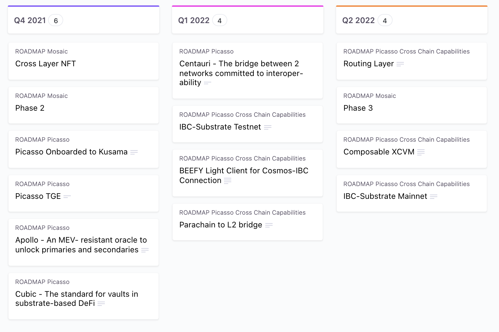

# Composable Finance Whitepaper
This repository contains the latest version of [Composable Finance](https://www.composable.finance/) whitepaper.
In the whitepaper, we cultivate and analyze all the technical details regarding the different projects and technologies that build Composable. 

You can check the deployed web version [here](https://paper.composable.finance/).

## Building

### Pre-requisites
You need to install Pandoc and a few packages in order to be able to compile the project.

#### From script
You can install the dependencies by running the script `scripts/setup.sh`:
~~~~~~~
chmod u+x scritps/setup.sh
./scripts/setup.sh
~~~~~~~

#### Manual Installation
If you prefer to manually install the latest version of the packages, you need to install `pandoc` e.g. from here:
~~~~~~~
https://github.com/jgm/pandoc/releases/tag/2.16.1
~~~~~~~
and `pandoc-crossref` e.g.
~~~~~~~
https://github.com/lierdakil/pandoc-crossref/releases
~~~~~~~

### How to generate the HTML
Simple run `make clean && make dist` and open `dist/index.html` or `site/index.html`(the version being deployed on the web).

## Editing and proposing changes
The whitepaper is written in Markdown format because of its great properties, cross-platform support and facility to integrate within the web.
Specifically, the [Pandoc](https://pandoc.org/) [custom Markdown version](https://garrettgman.github.io/rmarkdown/authoring_pandoc_markdown.html#verbatim_(code)_blocks).
Pandoc's markdown expands and enhances the plain Markdown standard to include new features such as identifiers and cross-references.
This condition may cause the markdown file not to be flawless represented when using other standards (e.g: Github's markdown).
Nonetheless, when compiled with Pandoc, the output is correct and fully compatible.

The core of the whitepaper content is located in the `whitepaper.md` file. To make a change on the whitepaper you need to folow this steps:

  1. Open `whitepaper.md` and make the desired edits. See below for a small guide on how to update the markdown file. For a more complete handbook, we refer the interested reader to the official [documentation](https://pandoc.org/MANUAL.html#pandocs-markdown).
  2. Build locally (See Building section) to check errors and output.
  3. Commit changes. Pull/Push or create a pull request if you forked the repository.
  4. Ensure the [Github actions](https://github.com/ComposableFi/whitepaper/actions) is properly triggered and the deployment is correct.
  5. Check the [website](https://paper.composable.finance/) to see the changes have propagated adequately. 
  
### Cross-references
To introduce a cross-reference we can include the tag `{#sec:sectionIV}`.
Identifiers must be in lowercase and can include hyphens "-".
They can be used to reference images, sections, equations etc.

Example:
~~~~~~~
# 3. Cross-Chain Virtual Machine {#sec:xcvm}
{#fig:roadmap}
$$a² = b² + c²$${#eq:pythagoras}
~~~~~~~
To reference an identifier simply use brackets `[@sec:xcvm]`, `[@fig:roadmap]`, `[@eq:pythagoras]`.

**For image identifiers to work, a new line is needed after the image declaration.**

**Equation cross-references only work when using double dollar notation `$$equation$$`.
Other environments e.g. `\begin{equation}` are not supported.**

### Images
To add an image, simply add the new figure in `site/images` and reference it using standard Markdown:

~~~~~~~
{#fig:figure_id}
~~~~~~~

**Spacing is critical when using and referencing images. Specially when using multiples figures together.**

### References
We support standard bibtex quotation.
To introduce a new reference, add the journal/link/conference at the end of `references.bib`.
To reference it on the Markdown simply use `[@referenceName]`.
Build again and the `styles/csl/ieee.csl` will take care of it.

### Equations and math
We use [Mathjax](https://www.mathjax.org/#docs) to obtain beautifully and interactive mathematical equations.
It is compatible with the Latex [Math environment](https://en.m.wikibooks.org/wiki/LaTeX/Mathematics) and supports almost any symbol.

To read more about mathematical expressions on Latex you can check this [guide](https://www.overleaf.com/learn/latex/Mathematical_expressions).

**As mentioned before, while all the math expressions are supported. Cross-references only work if we employ double dollar notation.**
